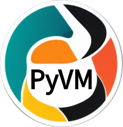

# PyVM
dead-simple python version manager powered by [python-build-standalone](https://github.com/indygreg/python-build-standalone)

# Installation

`pyvm` is a single-file self-bootstrapping script, all you need to do to install it is put it somewhere on your $PATH.

```console
mkdir -p ~/.local/bin
wget -o ~/.local/bin/pyvm alextremblay.github.io/pyvm/pyvm.py

echo 'export PATH="$PATH:~/.local/bin"' >> ~/.bashrc
```

`pyvm` will work on any modern-ish Linux/MacOS computer that has either `curl` or `wget` installed.

# features
- Can manage multiple portable python installations sourced from the amazing [PBS](https://github.com/indygreg/python-build-standalone) project
- installs python versions to isolated location, doesn't interfere with or interact with any version of python installed/used by your operating system

# Use Cases

## I want python3.10 and 3.11 on my PATH

```console
pyvm install 3.10
pyvm install 3.11
```

## I have a python script i want to run with Python3.12

Make your script executable and add the following [shebang](https://linuxhandbook.com/shebang/) line to the top of it:

```sh
#!/usr/bin/env pyvm run 3.12
```

# Extra Info

These python installations are isolated from any version of python that may already be installed on your system. They are installed into `~/.pyvm` by default, but this location can be changed by setting the `$PYVM_HOME` environment variable
Every installed version of python gets symlinked into a folder on your PATH. By default, these symlinks are installed into `~/.local/bin`, but this location can be changed by setting the `$PYVM_BIN` environment variable

For example, the command `pyvm install 3.11` will install python 3.11 into `~/.pyvm/3.11`, and `~/.local/bin/python3.11` will be symlinked to `~/.pyvm/3.11/bin/python3.11`


# Compatability
`pyvm` has been tested in linux (ubuntu x86_64 14.04+ and fedora 32+) and macos (macOS 13.6 aarch64), but should theoretically work in any linux x86_64 or aarch64 distribution (as long as `curl` or `wget` are installed), and any version of macOS

# Stretch goals
`pyvm` is still a very young project, and there are many features that have yet to be implemented:

- pipx integration (possibly by bootstrapping the pipx pex file into PYVM_HOME)
- ability to upgrade python installations when new releases of https://github.com/indygreg/python-build-standalone come out
- a `--global` flag which will set `$PYVM_HOME` default value to `/opt/pyvm` and `$PYVM_BIN` to `/usr/local/bin`
- test coverage >=80%
- windows support
- musl support
- an install script for people who think copy-pasting 3 lines into their terminal is 2 too many :P

# contributing
Contributions are more than welcome! The design of pyvm is deliberately simple. Feel free to fork it, vendor it, modify it as you please
If you make an improvement that you think others might like, please feel free to submit a PR, I'd be more than happy to work with you on it :)
